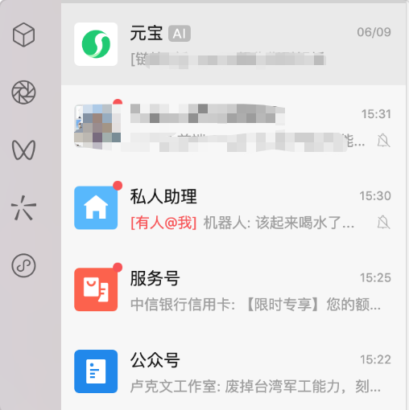
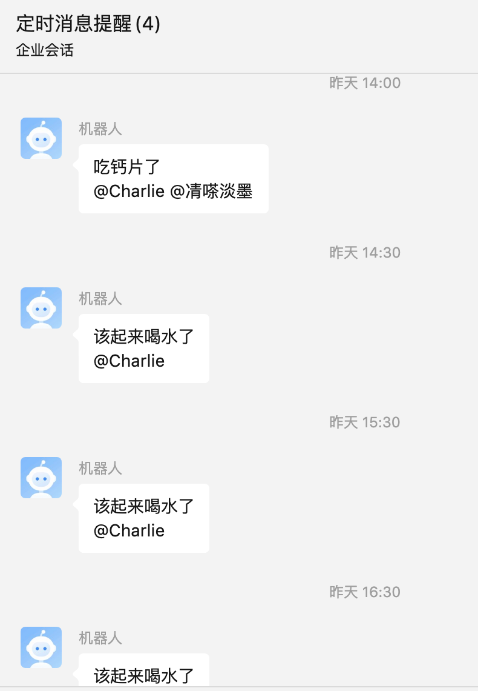
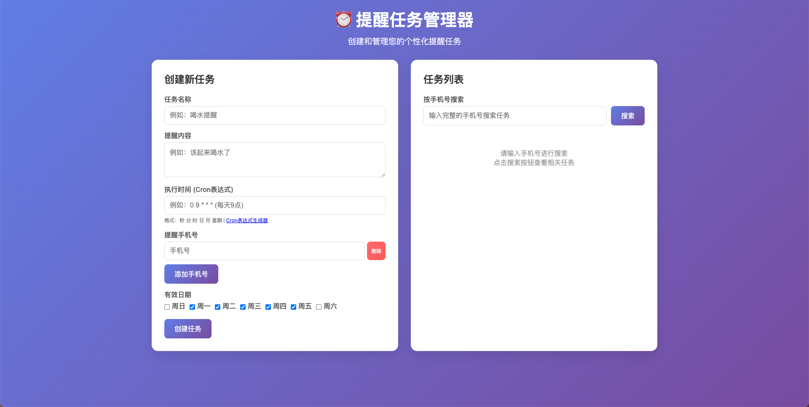
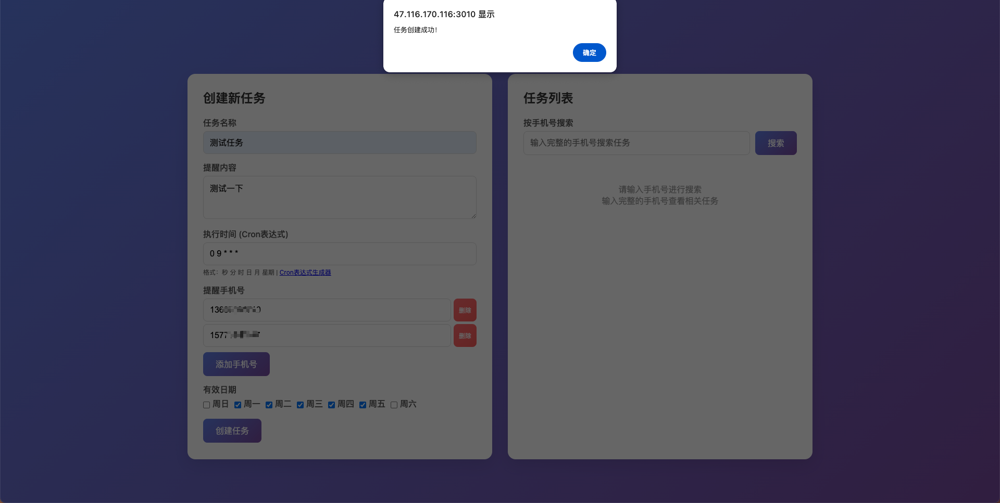
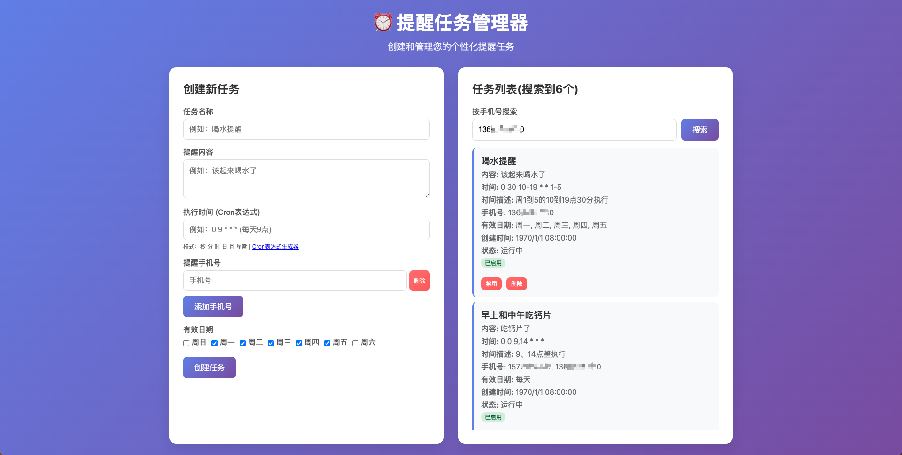

# WeChat Work Bot Scheduler

[English](#english) | [中文](#中文)

<div id="english"></div>

## English

A lightweight Node.js-based task scheduler for enterprise WeChat (WeChat Work) robot notifications. Create and manage scheduled reminders through a web interface.

### 🚀 Features

- ✅ **Dynamic Task Management**: Create, edit, and delete reminder tasks via web interface
- ✅ **Flexible Scheduling**: Support for Cron expressions with precise time control
- ✅ **Multiple Recipients**: Send reminders to multiple phone numbers simultaneously
- ✅ **Date Filtering**: Set reminders to specific days of the week
- ✅ **Task Status Control**: Enable/disable tasks as needed
- ✅ **Persistent Storage**: Task configurations saved in JSON file, automatically restored after restart
- ✅ **Web Dashboard**: Clean and intuitive web interface for task management

### 📋 Quick Start

#### 1. Register WeChat Work Account

Free registration for individuals: [https://work.weixin.qq.com/wework_admin/register_wx](https://work.weixin.qq.com/wework_admin/register_wx)

Create an internal group and add family/friends who need reminders.

#### 2. Installation

```bash
# Clone the repository
git clone https://github.com/xintianyou/weixin-notify-reminder
cd wechat-work-bot-scheduler

# Install dependencies
npm install
```

#### 3. Configuration

1. Copy the example environment file:
```bash
cp .env.example .env
```

2. Edit `.env` file with your configuration:
```bash
# WeChat Work Bot Configuration
WECHAT_WEBHOOK_URL=https://qyapi.weixin.qq.com/cgi-bin/webhook/send
WECHAT_WEBHOOK_KEY=your_actual_webhook_key_here

# Application Configuration
TZ=Asia/Shanghai
PORT=3000
```

#### 4. Start the Service

**Using PM2 (Recommended for production):**
```bash
npm run pm2
```

**Direct start (for development):**
```bash
npm start
```

**Development with auto-reload:**
```bash
npm run dev
```

#### 5. Access Web Interface

Visit: http://localhost:3000

### 🖥️ Web Interface Features

#### Create New Task

1. **Task Name**: Give your task a name (e.g., "Drink Water Reminder")
2. **Reminder Message**: The actual message to send
3. **Schedule Time**: Use Cron expressions to set timing
   - Daily at 9 AM: `0 9 * * *`
   - Every 30 minutes: `*/30 * * * *`
   - Weekdays 9 AM-7 PM every 30 min: `30 9-19 * * 1-5`
4. **Phone Numbers**: Add multiple phone numbers for WeChat Work users
5. **Active Days**: Choose specific days of the week for reminders

#### Manage Existing Tasks

- **Enable/Disable**: Toggle task status with a click
- **Delete**: Remove tasks with the delete button
- **Edit**: Update task details

### 🕐 Cron Expressions

Format: `second minute hour day month weekday`

| Field | Range | Special Characters |
|-------|-------|-------------------|
| Second | 0-59 | `* , - */` |
| Minute | 0-59 | `* , - */` |
| Hour | 0-23 | `* , - */` |
| Day | 1-31 | `* , - */ ? L W` |
| Month | 1-12 | `* , - */` |
| Weekday | 0-6 (0=Sunday) | `* , - */ ? L #` |

#### Common Examples

- `0 9 * * *` - Daily at 9 AM
- `0 9,14 * * *` - Daily at 9 AM and 2 PM
- `0 9 * * 1-5` - Monday to Friday at 9 AM
- `*/30 * * * *` - Every 30 minutes
- `0 9 1 * *` - First day of every month at 9 AM

### 🔧 API Endpoints

#### Get All Tasks
```
GET /api/tasks
```

#### Create New Task
```
POST /api/tasks
{
  "name": "Task Name",
  "message": "Reminder message",
  "cron": "0 9 * * *",
  "mobileNumbers": ["phone1", "phone2"],
  "activeDays": [1, 2, 3, 4, 5], // Monday to Friday
  "enabled": true
}
```

#### Update Task
```
PUT /api/tasks/:id
{
  "name": "Updated Task Name",
  "enabled": false
}
```

#### Delete Task
```
DELETE /api/tasks/:id
```

### 📁 Project Structure

```
├── reminder.js              # Main application file
├── ecosystem.config.js      # PM2 configuration
├── package.json             # Project dependencies
├── .env.example             # Environment variables template
├── .gitignore              # Git ignore rules
├── LICENSE                 # MIT License
├── README.md               # Project documentation
├── tasks.json              # Task storage (auto-created)
├── public/
│   └── index.html          # Web interface
└── utils/
    └── index.js            # Utility functions
```

### 🛠️ Development

#### Prerequisites
- Node.js >= 14.0.0
- npm >= 6.0.0

#### Available Scripts

```bash
npm start        # Start the application
npm run dev      # Start with nodemon for development
npm run pm2      # Start with PM2
npm run pm2:stop # Stop PM2 process
npm run pm2:restart # Restart PM2 process
npm run pm2:logs # View PM2 logs
```

### 🐛 Troubleshooting

#### Tasks Not Executing
1. Check if Cron expression is valid
2. Ensure task is enabled
3. Verify current day is in active days
4. Check logs for detailed error information

#### Cannot Access Web Interface
1. Confirm service is running
2. Check if port is occupied
3. Review firewall settings

#### Messages Not Sending
1. Verify webhook URL is correct
2. Check network connectivity
3. Review WeChat Work bot configuration

### 📄 License

This project is licensed under the MIT License - see the [LICENSE](LICENSE) file for details.

---

<div id="中文"></div>

## 中文

基于Node.js的企业微信机器人定时提醒系统，通过Web界面创建和管理定时任务。

## 效果







> “私人助理”是企业微信账号的企业名称

### 🚀 功能特性

- ✅ **动态任务管理**：通过Web界面创建、编辑、删除提醒任务
- ✅ **灵活的时间设置**：支持Cron表达式，精确控制提醒时间
- ✅ **多手机号支持**：可以同时提醒多个手机号
- ✅ **日期过滤**：可以设置只在特定日期发送提醒
- ✅ **任务状态管理**：可以随时启用/禁用任务
- ✅ **持久化存储**：任务配置保存在JSON文件中，重启后自动恢复
- ✅ **Web管理界面**：简洁直观的Web界面进行任务管理

### 📋 快速开始

#### 1. 注册企业微信账号

个人也能免费注册，官网：[https://work.weixin.qq.com/wework_admin/register_wx](https://work.weixin.qq.com/wework_admin/register_wx)

然后建内部群，把需要提醒的家人朋友拉进来

#### 2. 安装

```bash
# 克隆仓库
git clone https://github.com/xintianyou/weixin-notify-reminder
cd weixin-notify-reminder

# 安装依赖
npm install
```

#### 3. 配置

1. 复制示例环境文件：
```bash
cp .env.example .env
```

2. 编辑 `.env` 文件，填入您的配置：
```bash
# 企业微信机器人配置
WECHAT_WEBHOOK_URL=https://qyapi.weixin.qq.com/cgi-bin/webhook/send
WECHAT_WEBHOOK_KEY=your_actual_webhook_key_here

# 应用配置
TZ=Asia/Shanghai
PORT=3000
```

#### 4. 启动服务

**使用PM2启动（推荐，用于生产环境）：**
```bash
npm run pm2
```

**直接启动（用于开发测试）：**
```bash
npm start
```

**开发模式自动重启：**
```bash
npm run dev
```

#### 5. 访问Web界面

启动后访问：http://localhost:3000

### 🖥️ Web界面功能

#### 创建新任务

1. **任务名称**：给任务起个名字，如"喝水提醒"
2. **提醒内容**：具体要发送的提醒文字
3. **执行时间**：使用Cron表达式设置时间
   - 每天9点：`0 9 * * *`
   - 每小时30分：`30 * * * *`
   - 周一至周五10-19点每30分钟：`30 10-19 * * 1-5`
4. **提醒手机号**：可以添加多个手机号，对应企业微信用户
5. **有效日期**：选择只在特定日期发送提醒

#### 管理现有任务

- **启用/禁用**：点击按钮切换任务状态
- **删除**：点击删除按钮移除任务
- **编辑**：更新任务详情

### 🕐 Cron表达式说明

格式：`秒 分 时 日 月 星期`

| 字段 | 范围 | 特殊字符 |
|------|------|----------|
| 秒 | 0-59 | `* , - */` |
| 分 | 0-59 | `* , - */` |
| 时 | 0-23 | `* , - */` |
| 日 | 1-31 | `* , - */ ? L W` |
| 月 | 1-12 | `* , - */` |
| 星期 | 0-6 (0=周日) | `* , - */ ? L #` |

#### 常用例子

- `0 9 * * *` - 每天9点
- `0 9,14 * * *` - 每天9点和14点
- `0 9 * * 1-5` - 周一到周五9点
- `*/30 * * * *` - 每30分钟
- `0 9 1 * *` - 每月1号9点

### 🔧 API接口

#### 获取所有任务
```
GET /api/tasks
```

#### 创建新任务
```
POST /api/tasks
{
  "name": "任务名称",
  "message": "提醒内容",
  "cron": "0 9 * * *",
  "mobileNumbers": ["手机号1", "手机号2"],
  "activeDays": [1, 2, 3, 4, 5], // 周一到周五
  "enabled": true
}
```

#### 更新任务
```
PUT /api/tasks/:id
{
  "name": "新任务名称",
  "enabled": false
}
```

#### 删除任务
```
DELETE /api/tasks/:id
```

### 📁 项目结构

```
├── reminder.js              # 主程序文件
├── ecosystem.config.js      # PM2配置文件
├── package.json             # 项目依赖
├── .env.example             # 环境变量模板
├── .gitignore              # Git忽略规则
├── LICENSE                 # MIT许可证
├── README.md               # 项目文档
├── tasks.json              # 任务存储（自动生成）
├── public/
│   └── index.html          # Web界面
└── utils/
    └── index.js            # 工具函数
```

### 🛠️ 开发

#### 前置要求
- Node.js >= 14.0.0
- npm >= 6.0.0

#### 可用脚本

```bash
npm start        # 启动应用
npm run dev      # 使用nodemon启动开发模式
npm run pm2      # 使用PM2启动
npm run pm2:stop # 停止PM2进程
npm run pm2:restart # 重启PM2进程
npm run pm2:logs # 查看PM2日志
```

### 🐛 故障排除

#### 任务不执行
1. 检查Cron表达式是否正确
2. 确认任务已启用
3. 检查当前日期是否在有效日期内
4. 查看日志文件获取详细错误信息

#### 无法访问Web界面
1. 确认服务已启动
2. 检查端口是否被占用
3. 查看防火墙设置

#### 消息发送失败
1. 检查Webhook地址是否正确
2. 确认网络连接正常
3. 查看企业微信机器人配置

### 📄 许可证

本项目采用 MIT 许可证 - 查看 [LICENSE](LICENSE) 文件了解详情。

### 🤝 贡献

欢迎提交 Issue 和 Pull Request！

### 📧 联系

如有问题，请提交 [GitHub Issue](https://github.com/yourusername/wechat-work-bot-scheduler/issues)。